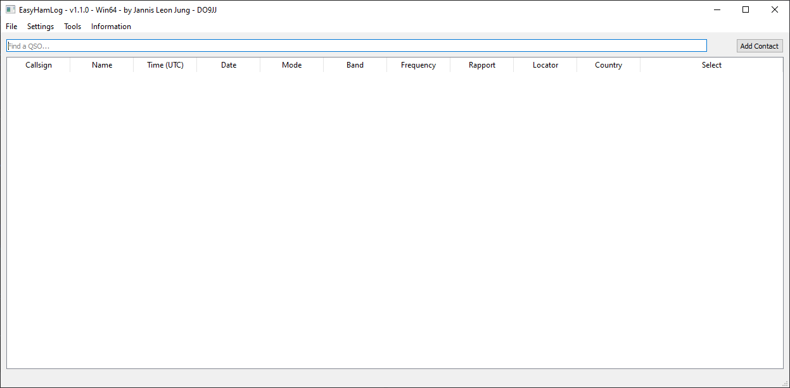
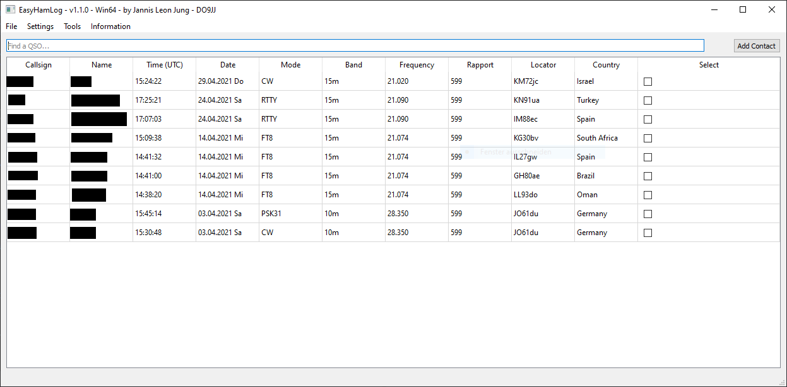
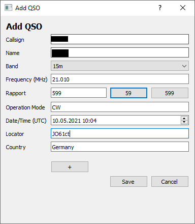

# EasyHamLog

## 1.0 Idea
My idea for EasyHamLog was to create a simple open-source QSO-logbook with easy cross-compilation while still having a lot of nice to have features like Maps, sync with [QRZ.com](https://qrz.com) and lookup tables for different ham-radio related stuff. 

## 2.0 Features
- Manage QSOs
- Search for QSOs in the current database
- Automatic lookup for country prefixes
- Export QSO session to ADI file format
- Create and open different sessions
- Look up callsigns in [QRZ.com](https://qrz.com) automatically
- Contest functionality

## 3. 0 TODO's
- Find someone for a propper app icon
- Add Map with QSO Locations + additional Information (Distance, Rapport, etc.)
- Mac installer

## 4.0 Bugs

## 5.0 Installation

### <b>5.1. Installation Linux (from source)</b>
1. Clone or download the repository
2. Run installer_linux.sh from the EasyHamLog folder
3. EasyHamLog is now installed in your EasyHamLog/build folder

### <b>5.2. Installation Windows (from source)</b>
<b>5.2.1. General Installation</b>
1. Clone or download the repository
2. Download and install [CMake](https://cmake.org/) and [Qt5](https://www.qt.io/)
3. Create a new System Variable called QTDIR and point it to QR_INSTALL_DIR\QT_VERSION\USED_COMPILER
4. Either add QR_INSTALL_DIR\QT_VERSION\USED_COMPILER\bin to your Systems PATH variable or have a look at the next Chapter
5. Run BuildWinXX.bat from the EasyHamLog folder

<b>5.2.2 Install EasyHamLog with the DLLs directly in your executable folder</b>
1. Run BuildWinXX.bat normally
2. Copy Qt5Core.dll, Qt5Gui.dll, Qt5Widgets.dll and Qt5Xml.dll from QR_INSTALL_DIR\QT_VERSION\USED_COMPILER\bin into the executables directory
3. Copy QR_INSTALL_DIR\QT_VERSION\USED_COMPILER\plugins\platforms\qwindows.dll into EXE_DIRECTORY\plugins\platforms
4. Copy QR_INSTALL_DIR\QT_VERSION\USED_COMPILER\plugins\styles\qwindowsvistastyle.dll into EXE_DIRECTORY\plugins\styles

### <b>5.3. TODO: Installation MacOS (from source)</b>

## 6 Troubleshooting
- When using Linux Qt5, you may have to execute ```xhost +``` before running ```sudo ./EasyHamLog```

## 7 Screenshots

Empty Session:



QSO session:



Add new QSO:


